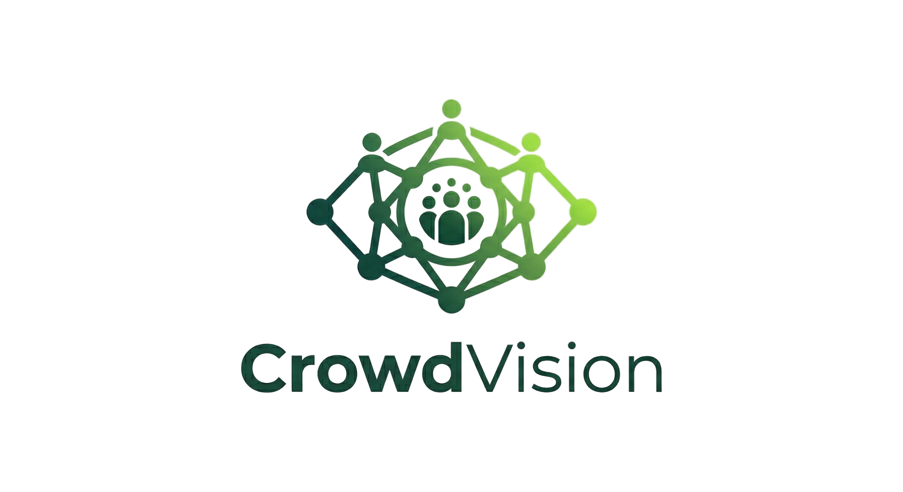

  

CrowdVision is an advanced digital twin and facility management platform designed to provide real-time insights into building occupancy, environmental conditions, and spatial utilization. 

## 🎯 Our Goal

The primary goal of CrowdVision is to bridge the gap between physical spaces and digital monitoring. By leveraging interactive 3D models and real-time data streams, CrowdVision empowers administrators, staff, and users to:
* **Visualize** buildings, floors, and rooms through dynamic 3D digital twins.
* **Monitor** real-time metrics such as room capacity, active occupancy (crowd density), and temperature.
* **Manage** access securely across multiple business domains and subdomains using robust role-based authentication and SSO (OIDC).
* **Stay Informed** through real-time push notifications and an integrated AI assistant.

---

## 📘 Documentation & Developer Guide

**All development instructions, setup guides, and architectural details are hosted on our official documentation site.**

Whether you are a user learning how to navigate the dashboard, or a developer looking to spin up the local environment, generate VAPID keys, or trigger semantic releases, please visit our GitHub Pages website:

👉 **[CrowdVision Official Documentation](https://nickghignatti.github.io/crowd-vision/)**

---

## 🔑 AI Agent API Keys

The agent-service uses two LLM providers and needs an API key for each:

- `GOOGLE_API_KEY` — Gemini (chat + embeddings). Create one at <https://aistudio.google.com/apikey>.
- `DEEPSEEK_API_KEY` — DeepSeek (alternative chat backend). Create one at <https://platform.deepseek.com/api_keys>.

The `npm run setup` script (run automatically by `npm run docker:dev` / `npm run docker:start`) will prompt you for both and write them to your local `.env`. You can leave them empty if you don't plan to use the agent — the service will boot, but `/ask` will fail on the first LLM call.

For the full env layout (Docker Compose **and** Kubernetes secret manifests under `k8s/secrets/agent.yml`), see [Environment Setup in the developer docs](documentation/developer/page-11.qd).

