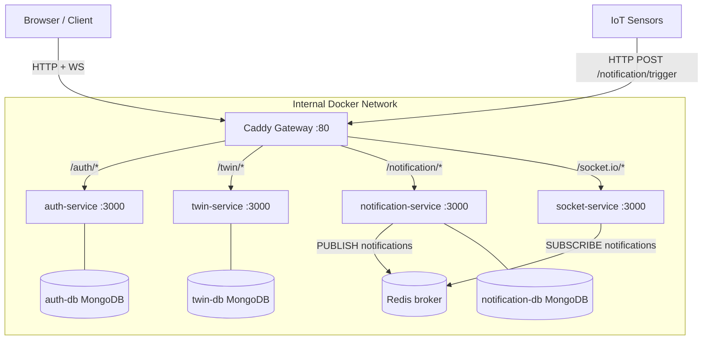

# Architecture

## High-level topology

All HTTP/WebSocket traffic enters through a single **Caddy** gateway on port 80. Caddy strips the service-prefix and reverse-proxies to the target container on the internal Docker bridge network.

Each service is isolated on two networks: `gateway-net` (shared) and a private network for its own MongoDB instance (`auth-net`, `twin-net`, `notification-net`). This enforces the **Database-per-Service** pattern.

## Routing table

| Path prefix | Backend |
|-------------|---------|
| `/auth/*` | `auth-service:3000` |
| `/twin/*` | `twin-service:3000` |
| `/notification/*` | `notification-service:3000` |
| `/socket.io/*` | `socket-server:3000` |
| `/auth-db-gui/*` | `auth-db-express:8081` *(dev only)* |
| `/twin-db-gui/*` | `twin-db-express:8081` *(dev only)* |

## Real-time data flow

1. A sensor (or POST to `/notification/trigger`) calls `publishNotification`.
2. `notificationService` serialises the payload and calls `redisClient.publish('notifications', ...)`.
3. `socket-service` Redis subscriber receives the message → `io.emit('notification', data)` → all connected clients.
4. The Vue client's `socket.ts` receives the event and prepends to the reactive `socketState.notifications` array.
5. `NotificationBell` badge and `PushNotificationToast` update reactively.