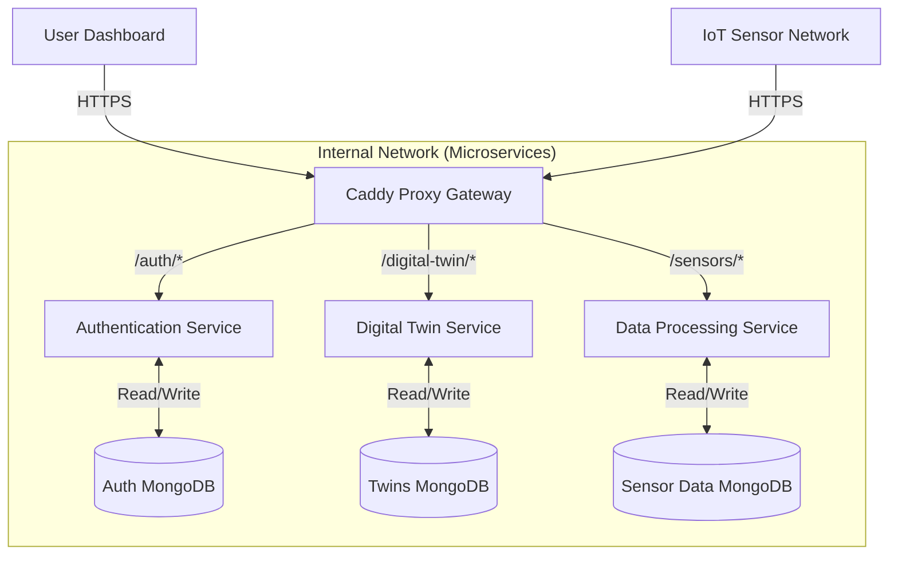

# Architecture

Crowd Vision is a scalable, digital-twin solution designed to monitor and visualize crowd density within building
structures in real-time. The system employs an event-driven architecture to handle high-frequency data streams from IoT
sensors, visualizing them on a 3D web dashboard.

## 1. High-level architecture

The system follows a Client-Server architecture, with the server composed by multiple microservices. A **Caddy** reverse proxy acts as the single entry point (Gateway), managing the internal network and routing requests to specific autonomous services.

The backend is divided into three core domain services:

- **Authentication Service**: Manages user identity and access control.
- **Digital Twin Service**: Manages the state and configuration of building digital twins.
- **Data Processing Service**: Ingests, filters, and organizes raw telemetry from IoT sensors.

## 2. Infrastructure & Deployment
The application infrastructure is containerized, with services orchestrated via Docker Compose.

- **Gateway Layer**: Caddy handles SSL termination, load balancing, and routing to the internal Docker network.ù
- **Database Layer**: We adhere to the Database-per-Service pattern. Each microservice connects to its own dedicated MongoDB instance to ensure loose coupling and independent scaling.

## 3. Core components & Technology stack

### Client / Frontend

- Framework : Vue3
- Twin visualization : Three.js
- Styling : Tailwind CSS
- Build tool : Vite

### Authentication Service
Responsible for all security-related operations.

- Stack: Node.js / TypeScript.
- Responsibilities: User registration, login and validating session states.
- Data: Stores user credentials and profile information.

### Digital twin Service
Handles the static and dynamic configuration of the monitored environments.

- Stack: Node.js / TypeScript.
- Responsibilities: CRUD operations for buildings, rooms, and sensor placement configurations.
- Data: Stores 3D models metadata and building hierarchy.

### Data processing Service
The high-throughput component that handles real-time streams.

- Stack: Node.js / TypeScript.
- Responsibilities: Receives raw sensor data, filters noise, aggregates readings, and prepares data for the frontend visualization.
- Data: Stores historical sensor logs and processed metrics.